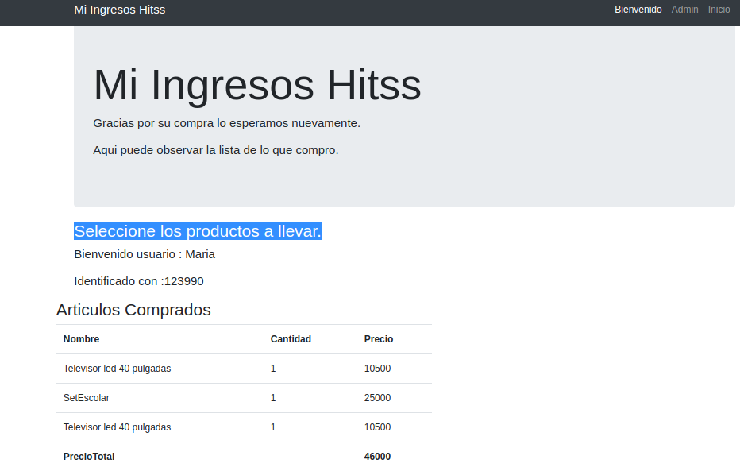

# Mi Ingreso Hitss

## Para Empresa Global Hits 
## 2019-2 
##  Cesar Eduardo Lanos Camacho, estudiante de la Escuela Colombiana de Ingeniería Julio Garavito - Ingeniería de Sistemas 10 semestre
#### Es una herramienta web de un almacen para administrar los productos  y los clientes que realizan compran en el.

---
### Integrante
- Cesar E. Lanos Camacho
### Empresa
- Global Hits
---
### :link: URLs
| Elemento | Link |
|:-------------------------------------:|:----------------------------------------------------------------------------------------------------:|
| Javadoc | Generado en la ruta ./target/site/apidocs |
| Heroku | https://globalhits.herokuapp.com/ | 
---
### :book: Instrucciones

Bienvenido a Mi Ingreso Hitss

Esta herramienta le permitira como usurio ingresar al inventario del almacen y adicionar al carrito de compras los diferentes productos y el precio total a pagar.
Una vez decida pagar por ellos ver un resumen de lo que acaba de comprar y su costo total.

Como administrador podra agregar clientes y productos, modificarlos y eliminarlos. Ademas de poder observar un reporte de las ventas realizadas en un periodo de tiempo.

Como cliente:

1. Paso
    Al momento de ingresar a la aplicacion (https://globalhits.herokuapp.com/ ), ingrese su nombre   y identificacion y de click en bienvenido. 
   
2. Paso

   Ahora se encontrara en el inventario, escoga  cualquiera de los productos exhibidos y agregelos al carrito. Cuando este listo de click en pagar y listo esos productos son suyos.

3. Paso

    En esta ultima vista podra observar los productos que compro y verificar cual fue el costo.

Como administrador:

1. Paso

    Al momento de ingresar a la aplicacion (https://globalhits.herokuapp.com/ ), en la parte superior derecha encontrarala palabra admin, de clck en ella y  sera enviado a la vista de administrador.

2. Paso

    Una vez alli podra gestionar su almacen de la manera que desee. Ya que puede crear productos, clientes editarlos o eliminarlos si gusta.

En el siguiente item explicacion paso a paso.

---

### :camera: Pantallas de la aplicación-- Pruebas Funcionales.

### :book: Requisitos Funcionales

1. Cliente
- El cliente ingresa sus datos .

---

- El cliente ahora se encuuentra en el inventario, podra escoger los productos y añadirlos al carrito.

---

- El cliente agrego varios productos al carrito de compras. Ahora solo falta que el cliente pague.

---

- Se observa que el cliente pago y se  observa el resumen de su compra.

---
- -------.

---

- -------.

---
- ---------.

---

- --------.

---

- -------.

---

- ---------.

---

- --------.

---

- --------.

---

## Pruebas con Postman

---

## CartModeCOntroller

- --------.

---

- --------.

---

- --------.

---

- -------.

---
- ------.

---
- -------.

---

- -------.

---

- --------.

---
- -------.

---
- --------.

---
- -------.

---

- --------.

---
- -----.

---

- -------------.

---

## Mi Ingreso Hitss ControllerPersistence

---
- ------.

---
- -----.

---

## Mi Ingreso Hitss Controller Productos

---
- -----------.

---
- -----.

---
- -----.

## Mi Ingreso Hitss Controller Clientes

- ----

- -----

- ----

---

### :triangular_ruler: Diseño de arquitectura 
#### - Clases

---
### :wrench: Tecnologías utilizadas

---

